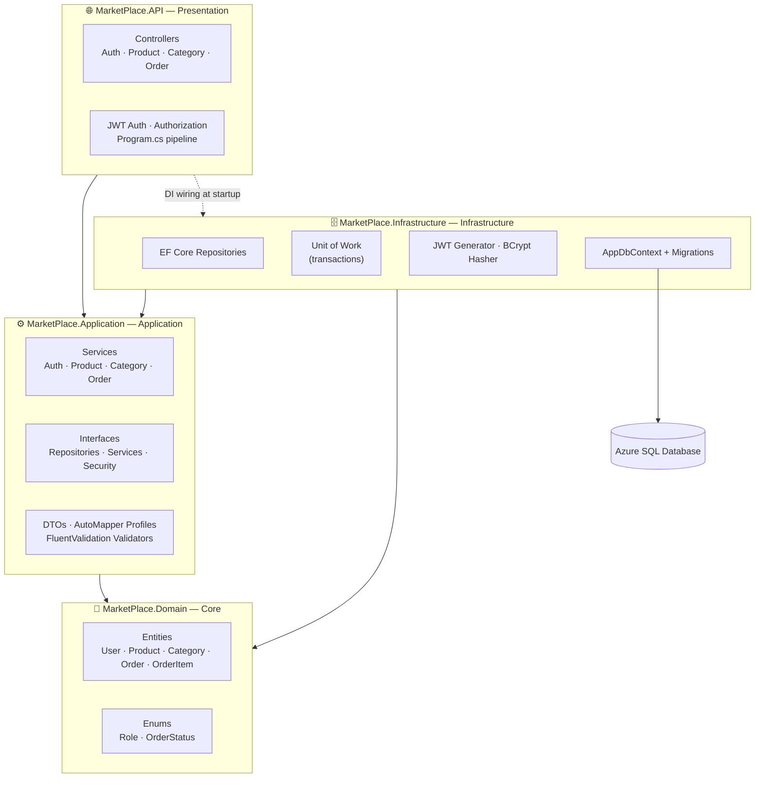
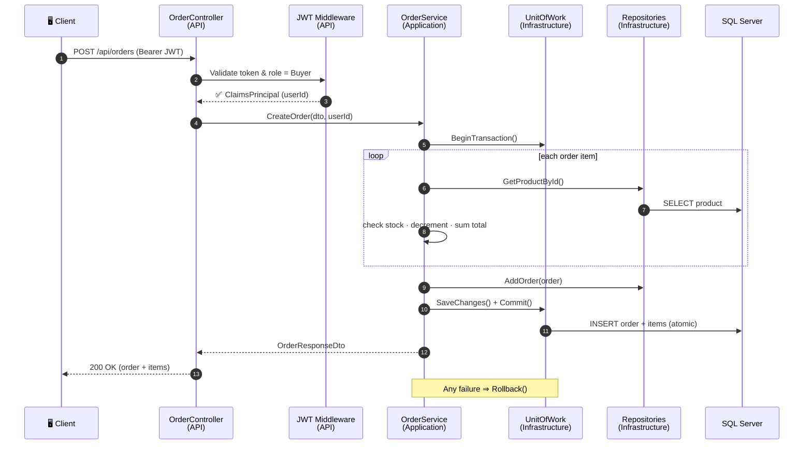
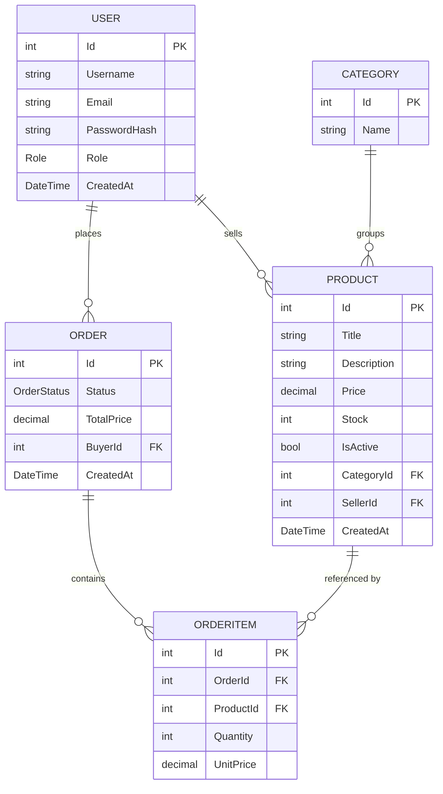

# 🛍️ MarketPlace API

> A clean, production-shaped **online marketplace backend** built with **ASP.NET Core 10** and **Onion (Clean) Architecture** — JWT authentication, role-based access, transactional ordering, and a searchable product catalog.

<p>
  
  
  
  
  
  
</p>

---

## 📑 Table of Contents

- [Overview](#-overview)
- [Architecture](#%EF%B8%8F-architecture)
- [Tech Stack](#-tech-stack)
- [Features](#-features)
- [Request Flow](#-request-flow)
- [Data Model](#-data-model)
- [API Endpoints](#-api-endpoints)
- [Getting Started](#-getting-started)
- [Frontend](#-frontend)
- [Project Structure](#-project-structure)
- [Notes & Known Limitations](#-notes--known-limitations)

---

## 🔎 Overview

**MarketPlace** is a RESTful backend for a multi-role e-commerce marketplace. It lets:

- **Buyers** register, browse/search products, and place orders that are processed atomically (stock is reserved inside a database transaction).
- **Sellers** manage their own product listings.
- **Admins** manage categories, view all orders, and update order status.

The solution is split into four projects following **Onion Architecture**, keeping business rules independent of the database and web framework, plus a dedicated test project.

---

## 🏛️ Architecture

The codebase is organized into concentric layers. Dependencies point **inward** — the `Domain` core depends on nothing, and outer layers depend on inner ones via interfaces.



**Dependency rule in practice**

| Layer | Depends on | Knows about EF Core / Web? |
|------|-----------|---------------------------|
| `Domain` | *nothing* | ❌ Pure C# entities & enums |
| `Application` | `Domain` | ❌ Only interfaces & DTOs |
| `Infrastructure` | `Application`, `Domain` | ✅ EF Core, BCrypt, JWT |
| `API` | `Application`, `Infrastructure` | ✅ ASP.NET Core host |

Interfaces are declared in **Application** (`Interfaces/Repository`, `Interfaces/Service`, `Interfaces/Security`) and implemented in **Infrastructure**, so the application core never references the database directly — the classic dependency-inversion seam of Onion Architecture.

---

## 🧰 Tech Stack

> Only technologies actually present in the code and `.csproj` files are listed.

| Category | Technology |
|---------|-----------|
| **Runtime / Framework** | .NET 10, ASP.NET Core Web API |
| **Language** | C# (nullable + implicit usings enabled) |
| **ORM / Data** | Entity Framework Core 10 (`Microsoft.EntityFrameworkCore.SqlServer`) with code-first Migrations |
| **Database** | Microsoft SQL Server (Azure SQL connection string) |
| **Authentication** | JWT Bearer (`Microsoft.AspNetCore.Authentication.JwtBearer`, `System.IdentityModel.Tokens.Jwt`) |
| **Password Hashing** | BCrypt (`BCrypt.Net-Next`) |
| **Object Mapping** | AutoMapper |
| **Validation** | FluentValidation (validators defined & registered in DI) |
| **API Docs Tooling** | Swashbuckle.AspNetCore + `Microsoft.AspNetCore.OpenApi` (registered — see [limitations](#-notes--known-limitations)) |
| **Testing** | Dedicated `MarketPlace.Tests` project |

**Design patterns used:** Onion/Clean Architecture · Repository · Unit of Work · Dependency Injection · DTO mapping.

---

## ✨ Features

> Each item below is backed by real code in the controllers/services.

### 🔐 Authentication & Authorization
- **Register** and **Login** endpoints returning a signed **JWT** (`AuthController`, `AuthService`).
- Passwords hashed and verified with **BCrypt** (`PasswordHasher`).
- JWT carries `NameIdentifier`, `Name`, `Role`, and `Email` claims; tokens expire after **3 hours** (`JwtTokenGenerator`).
- Duplicate-email registration is rejected (`Email already exists`).
- New registrations are always created with the **Buyer** role.

### 👥 Role-Based Access Control
Three roles (`Role` enum: `Buyer`, `Seller`, `Admin`) enforced with `[Authorize(Roles = ...)]`:

| Role | Can do |
|------|--------|
| **Buyer** | Place / view / cancel their own orders |
| **Seller** | Create, update, delete, and list **their own** products |
| **Admin** | Manage categories, list **all** orders, change order status |

### 🛒 Product Catalog
- **Search, filter, sort, and paginate** products in a single endpoint (`ProductRepository.SearchProducts`):
  - Free-text search on **title**
  - Filter by **category**, **min price**, **max price**
  - Sort by `price_asc`, `price_desc`, `title`, or **newest first** (default)
  - Page-based pagination returning `Items`, `Page`, `PageSize`, `TotalCount`, `TotalPages`
- Only **active** products are returned in search results.
- Sellers can list/update/delete **only products they own** (ownership checked via `SellerId`).

### 📦 Orders (Transactional)
- Placing an order runs inside a **database transaction** (`UnitOfWork.BeginTransaction/Commit/Rollback`):
  - Validates each product exists, is active, and has **enough stock**
  - **Decrements stock** and records the **unit price at purchase time**
  - Computes the order total server-side
  - **Rolls back** the entire order if any item fails
- **Cancel order** restores stock and is only allowed while an order is `Pending` or `Paid`.
- Admins can **list all orders** (paginated) and **change order status** (`Pending → Paid → Shipped → Delivered`, or `Cancelled`).

### 🗂️ Categories
- Public read (`GET`) of categories; **Admin-only** create/update/delete.

### 🏗️ Cross-Cutting
- **Repository + Unit of Work** abstractions over EF Core.
- **AutoMapper** profiles for Entity ⇆ DTO mapping.
- **EF Core retry-on-failure** enabled for transient SQL errors.

---

## 🔁 Request Flow

How a typical authenticated request (e.g. *"place an order"*) travels through the layers:



---

## 🗃️ Data Model



**Enums**

- `Role` → `Buyer (0)`, `Seller (1)`, `Admin (2)`
- `OrderStatus` → `Pending (0)`, `Paid (1)`, `Shipped (2)`, `Delivered (3)`, `Cancelled (4)`

---

## 🌐 API Endpoints

Base route prefix: `/api`. **Auth** column shows the required role (blank = public).

### 🔑 Auth — `/api/auth`
| Method | Endpoint | Auth | Description |
|-------|----------|------|-------------|
| `POST` | `/api/auth/register` | — | Register a new user (created as **Buyer**), returns JWT |
| `POST` | `/api/auth/login` | — | Authenticate, returns JWT |

### 🛍️ Products — `/api/products`
| Method | Endpoint | Auth | Description |
|-------|----------|------|-------------|
| `GET` | `/api/products` | — | Search/filter/sort/paginate products |
| `GET` | `/api/products/{id}` | — | Get a single product by id |
| `GET` | `/api/products/my` | Seller | List the current seller's products |
| `POST` | `/api/products` | Seller | Create a product |
| `PUT` | `/api/products/{id}` | Seller | Update own product |
| `DELETE` | `/api/products/{id}` | Seller | Delete own product |

**`GET /api/products` query parameters**

| Param | Type | Default | Notes |
|------|------|---------|-------|
| `search` | string | — | Matches product **title** (contains) |
| `categoryId` | int | — | Filter by category |
| `minPrice` / `maxPrice` | decimal | — | Price range |
| `sortBy` | string | newest | `price_asc` · `price_desc` · `title` |
| `page` | int | `1` | Page number |
| `pageSize` | int | `20` | Items per page |

### 🗂️ Categories — `/api/categories`
| Method | Endpoint | Auth | Description |
|-------|----------|------|-------------|
| `GET` | `/api/categories` | — | List all categories |
| `GET` | `/api/categories/{id}` | — | Get a category by id |
| `POST` | `/api/categories` | Admin | Create a category |
| `PUT` | `/api/categories/{id}` | Admin | Update a category |
| `DELETE` | `/api/categories/{id}` | Admin | Delete a category |

### 📦 Orders — `/api/orders` *(all require authentication)*
| Method | Endpoint | Auth | Description |
|-------|----------|------|-------------|
| `POST` | `/api/orders` | Buyer | Create an order (transactional) |
| `GET` | `/api/orders/my` | Buyer | List the current buyer's orders |
| `GET` | `/api/orders/{id}` | Buyer | Get one of the buyer's orders |
| `POST` | `/api/orders/{id}/cancel` | Buyer | Cancel an order (if Pending/Paid) |
| `GET` | `/api/orders` | Admin | List all orders (paginated) |
| `PUT` | `/api/orders/{id}/status` | Admin | Change an order's status |

---

## 🚀 Getting Started

### Prerequisites
- [.NET 10 SDK](https://dotnet.microsoft.com/download)
- A **SQL Server** instance (the default config targets **Azure SQL**; local SQL Server / LocalDB works too)

### 1. Configure

Update the connection string and JWT settings in [`MarketPlace.API/appsettings.json`](MarketPlace.API/appsettings.json):

```jsonc
{
  "ConnectionStrings": {
    "DefaultConnection": "Server=...;Initial Catalog=MarketPlaceDb;User ID=...;Password=...;Encrypt=True;"
  },
  "Jwt": {
    "Key": "your-long-secret-signing-key",
    "Issuer": "MarketPlaceAPI",
    "Audience": "MarketPlaceClient"
  }
}
```

> ⚠️ The repository ships with a working development connection string and JWT key for convenience. **Rotate these and move secrets out of source control** before any real deployment.

### 2. Apply database migrations

A code-first migration (`InitialCreate`) is included in `MarketPlace.Infrastructure/Migrations`.

```bash
dotnet ef database update --project MarketPlace.Infrastructure --startup-project MarketPlace.API
```

### 3. Run the API

```bash
dotnet run --project MarketPlace.API
```

By default the API listens on:

- `http://localhost:5222`
- `https://localhost:7107`

*(see [`MarketPlace.API/Properties/launchSettings.json`](MarketPlace.API/Properties/launchSettings.json))*

### 4. Run the tests

```bash
dotnet test
```

### Quick smoke test

```bash
# Register (returns a JWT)
curl -X POST http://localhost:5222/api/auth/register \
  -H "Content-Type: application/json" \
  -d '{"username":"jane","email":"jane@example.com","password":"secret123"}'

# Browse products
curl "http://localhost:5222/api/products?search=phone&sortBy=price_asc&page=1&pageSize=10"
```

---

## 🎨 Frontend

A polished, dependency-free storefront lives in the [`frontend/`](frontend) folder (plain **HTML + CSS + vanilla JavaScript**). It demonstrates the API in action:

- 🔐 Register / login with JWT stored in `localStorage`
- 🔎 Browse products with live search, category chips, price range, sorting, and pagination
- 🪟 Product detail view
- 🛒 Cart + transactional checkout (`POST /api/orders`) and **My Orders** with cancel

### Run it

```bash
# From the frontend/ folder — any static file server works:
cd frontend
python -m http.server 8099
# then open http://localhost:8099
```

Point it at your API by editing the single config constant at the top of [`frontend/config.js`](frontend/config.js):

```js
const API_BASE = "http://localhost:5222";     // local
// const API_BASE = "https://your-api.azurewebsites.net";  // deployed
```

> 💡 Because the frontend runs on a different origin than the API, the API must send **CORS** headers for the browser to accept its responses. See [limitations](#-notes--known-limitations) below.

---

## 📂 Project Structure

```
MarketPlace/
├── MarketPlace.Domain/          💎 Entities + Enums (no dependencies)
│   ├── Entities/                User, Product, Category, Order, OrderItem
│   └── Enums/                   Role, OrderStatus
│
├── MarketPlace.Application/     ⚙️ Business logic (depends on Domain)
│   ├── Interfaces/              Repository / Service / Security contracts
│   ├── Service/                 Auth, Product, Category, Order services
│   ├── DTOs/                    Request/response models
│   ├── Mapping/                 AutoMapper profiles
│   ├── Validators/              FluentValidation validators
│   └── DependencyInjection.cs   AddApplication()
│
├── MarketPlace.Infrastructure/  🗄️ Data & external concerns
│   ├── Data/                    AppDbContext
│   ├── Repository/              EF Core repositories
│   ├── UnitOfWork/              Transaction coordinator
│   ├── Security/                JwtTokenGenerator, PasswordHasher (BCrypt)
│   ├── Migrations/              EF Core migrations
│   └── DependencyInjection.cs   AddInfrastructure()
│
├── MarketPlace.API/             🌐 ASP.NET Core host
│   ├── Controllers/             Auth, Product, Category, Order
│   ├── Auth/                    Role name constants
│   ├── Program.cs               DI, JWT, pipeline
│   └── appsettings.json
│
├── MarketPlace.Tests/           🧪 Test project
└── frontend/                    🎨 HTML/CSS/JS storefront
```

---

## 📝 Notes & Known Limitations

In the spirit of an honest README, these are behaviors worth knowing that are visible in the current code:

- **CORS is not configured** in `Program.cs`. To call the API from the browser frontend on a different origin, add CORS — for example:

  ```csharp
  builder.Services.AddCors(o => o.AddDefaultPolicy(p =>
      p.WithOrigins("http://localhost:8099").AllowAnyHeader().AllowAnyMethod()));
  // after building the app, before UseAuthentication:
  app.UseCors();
  ```

- **No global exception-handling middleware.** Service-layer exceptions (e.g. `KeyNotFoundException`, `UnauthorizedAccessException`, `InvalidOperationException`) are not mapped to specific HTTP status codes, so they currently surface as `500`. The included frontend handles this gracefully.
- **Enums serialize as integers** (e.g. `Role` and `OrderStatus`) since no `JsonStringEnumConverter` is configured.
- **Swagger/OpenAPI generators are registered** (`AddSwaggerGen`, `AddOpenApi`) but the UI/endpoint is **not currently mapped** in the request pipeline, so there is no live docs URL out of the box.
- **Roles are assigned as Buyer on registration** — promoting a user to `Seller`/`Admin` is done directly in the database (no self-service role endpoint exists).

---

<p align="center"><sub>Built with ASP.NET Core 10 · Onion Architecture · EF Core · JWT</sub></p>
